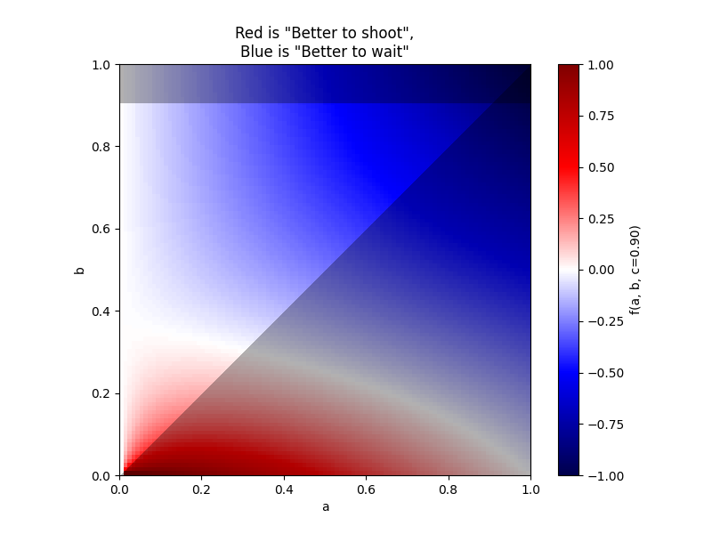

# Truel Strategy Simulator

This Python project simulates a shootout scenario between three individuals: Alice, Bob, and Charlie. 
Each individual has a specific probability of successfully shooting their target. 
The probabilities are defined as follows:

- Alice: Probability of killing her target is 'a'
- Bob: Probability of killing his target is 'b'
- Charlie: Probability of killing his target is 'c'

It is assumed that \( 0 <= a <= b <= c <= 1 \).

## How it Works

The shootout sequence is a loop that start with: Alice can shoots first, then Bob if he is still alive, then Charlie if he is still alive, then Alice if she is still alive...

We assume that if both Bob and Charlie are alive at some point, they will attempt to eliminate each other before proceeding (as they represent the biggest threat for each other).

The script calculates the optimal strategy for Alice, determining whether she should shoot Charlie (her biggest threat) or wait on Bob and Charlie to kill each other (as she would be the first to shoot in her dual with the survivor).

## Result

In most cases, there seems to be a value for 'b' (around 30%) over which it is a better strategy for Alice to withhold her shots and wait for Bob and Charlie to eliminate each other. This phenomenon is depicted in the generated plots, where regions of blue indicate scenarios where Alice's optimal strategy is to wait, while regions of red suggest it's better for her to shoot.




## Usage

### Requirements
- Python 3.x
- numpy
- matplotlib

### Installation
1. Clone the repository:

    ```bash
    git clone https://github.com/Uspectacle/Truel
    cd your_repository
    ```

2. Install the required dependencies:

    ```bash
    pip install -r requirements.txt
    ```

### Running the Simulation

Simply execute the Python script:

```bash
python main.py
```

The script will generate a series of plots depicting the optimal strategy for Alice under different scenarios, varying the probabilities 'a', 'b', and 'c'.

## Output

The script generates a series of plots stored in the 'output' directory. The plots illustrate the optimal strategy for Alice under different combinations of probabilities.

## License

This project is licensed under the GNUv3 License - see the [LICENSE](LICENSE) file for details.

---
*Note: This README is a fictional representation of the provided code for illustrative purposes.*